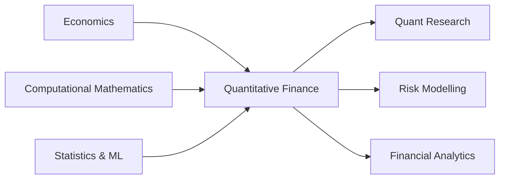

<!-- =========================================================
     MARIO MONTOSA — GitHub Profile
     Economics × Computational Mathematics × Quantitative Finance
========================================================== -->

<div align="center">


<a href="https://git.io/typing-svg">
  
</a>

<br>

<a href="https://www.linkedin.com/in/mario-montosa-s%C3%A1nchez-318841324/">
  
</a>
<a href="https://github.com/mariomontosa">
  
</a>


</div>

---

## `> about_me`

```text
Education     Double Degree in Economics &
              Computational Mathematics / Data Analysis @ UAB

Focus         Quantitative Finance · Financial Econometrics
              Machine Learning · Risk · Time Series

Approach      Economics gives context.
              Mathematics gives structure.
              Computation makes it testable.
```

I am currently pursuing a **Double Degree in Economics and Computational Mathematics & Data Analysis at Universitat Autònoma de Barcelona (UAB)**.

My main academic and technical interests sit at the intersection of **financial markets, mathematical modelling, statistics and computation**. I like approaching problems from both sides: understanding the economic structure behind them and building the quantitative tools required to test them with data.

I am particularly interested in **quantitative research, financial machine learning, econometrics, risk modelling and systematic financial analysis**.

---

## `> selected_projects`

<table>
<tr>
<td width="50%" valign="top">

### 📈 SPY Return Prediction

**Multivariate LSTM for Financial Time Series**

Research-oriented project studying next-period SPY log-return prediction using multivariate sequential models.

**Pipeline**

`Market Data` → `Features` → `Sequences` → `LSTM` → `Forecasts` → `Evaluation` → `Backtest`

**Key topics**

- Strict temporal train / validation / test methodology
- Financial feature engineering
- Multivariate sequence modelling
- PyTorch implementation
- Baselines & skill scores
- Forecast evaluation
- Backtesting methodology

<br>


</td>
<td width="50%" valign="top">

### ◈ Nezus

**Quantitative Research & Trading Infrastructure**

Experimental financial research environment designed as a central interface for market data, models, strategies, risk and quantitative research.

**System map**

`Data` → `Research` → `Models` → `Strategies` → `Risk` → `Performance`

**Key components**

- Market-data infrastructure
- Research workspace
- Strategy analytics
- Risk monitoring
- Backtesting tools
- Monte Carlo analysis
- Model management
- Financial APIs

<br>


</td>
</tr>
</table>

---

## `> quantitative_interests`

<div align="center">

| Quantitative Finance | Financial ML | Risk & Portfolio | Mathematics |
|:---:|:---:|:---:|:---:|
| Asset Pricing | Time Series | Market Risk | Probability |
| Financial Econometrics | Deep Learning | Model Risk | Statistics |
| Systematic Research | Forecast Evaluation | Portfolio Analytics | Stochastic Models |
| Market Modelling | Backtesting | Quantitative Risk | Optimisation |

</div>

---

## `> tech_stack`

### Quantitative computing

<p align="center">
  
</p>

<p align="center">
  
  
  
  
  
</p>

### Engineering & infrastructure

<p align="center">
  
</p>

<p align="center">
  
  
</p>

---

## `> research_framework`



My academic path is deliberately interdisciplinary: combining **economic intuition**, **mathematical structure** and **computational experimentation** rather than treating them as isolated areas.

---

## `> github_activity`

<div align="center">


<br><br>


</div>

---

## `> beyond_code`

Quantitative finance is my main technical direction, but my interests also extend into **economics, philosophy, technology and the foundations of scientific knowledge**.

I am particularly interested in the relationship between formal models and the reality they attempt to describe — and in how mathematics and computation expand what we are capable of understanding.

---

<div align="center">

### `Mathematics gives structure. Economics gives context. Computation makes it testable.`

<br>


<br><br>


</div>
