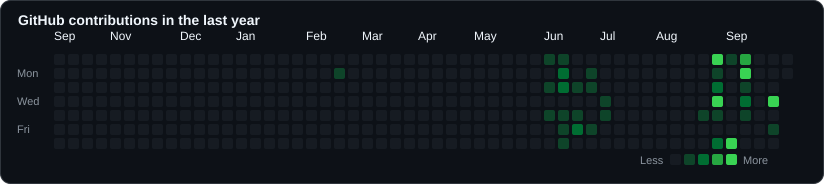

# Mario Montosa

**Economics & Computational Mathematics student building quantitative research and financial systems.**

I am pursuing a double degree in **Economics** and **Computational Mathematics & Data Analysis** at the **Universitat Autònoma de Barcelona**.

My work sits at the intersection of financial markets, statistics and computation. I am particularly interested in **quantitative research**, **financial econometrics**, **systematic investing** and **model risk**—turning economic questions into models that can be tested with data.

## Selected work

| Project | What I am building | Core methods |
|---|---|---|
| **SPY Market-State Forecasting** | A multi-task temporal model for future volatility, cumulative returns and probabilistic direction across several horizons. | Time-series modelling, PyTorch, walk-forward evaluation, backtesting |
| **Nezus Quant** | A research environment connecting market data, models, strategies, portfolio risk and performance analysis. **[Explore the live preview →](https://nezus-landing.vercel.app/)** | Python, FastAPI, React, Monte Carlo, risk analytics |
| **Nezus Assistant** | A self-hosted personal AI system that coordinates knowledge, automation and home services across a local infrastructure stack. | Python, Docker, PostgreSQL, Redis, APIs, Home Assistant |

> Current priority: rigorous out-of-sample evaluation and reproducible research pipelines for financial forecasting.

## Technical toolkit

**Languages:** Python · R · SQL · C · C++  
**Quant & data:** PyTorch · pandas · NumPy · SciPy · scikit-learn · Jupyter  
**Engineering:** Git · Docker · Linux · FastAPI · PostgreSQL · React

## GitHub activity

The calendar is generated from my GitHub contribution data and updated automatically.

---

*Mathematics gives structure. Economics gives context. Computation makes it testable.*
